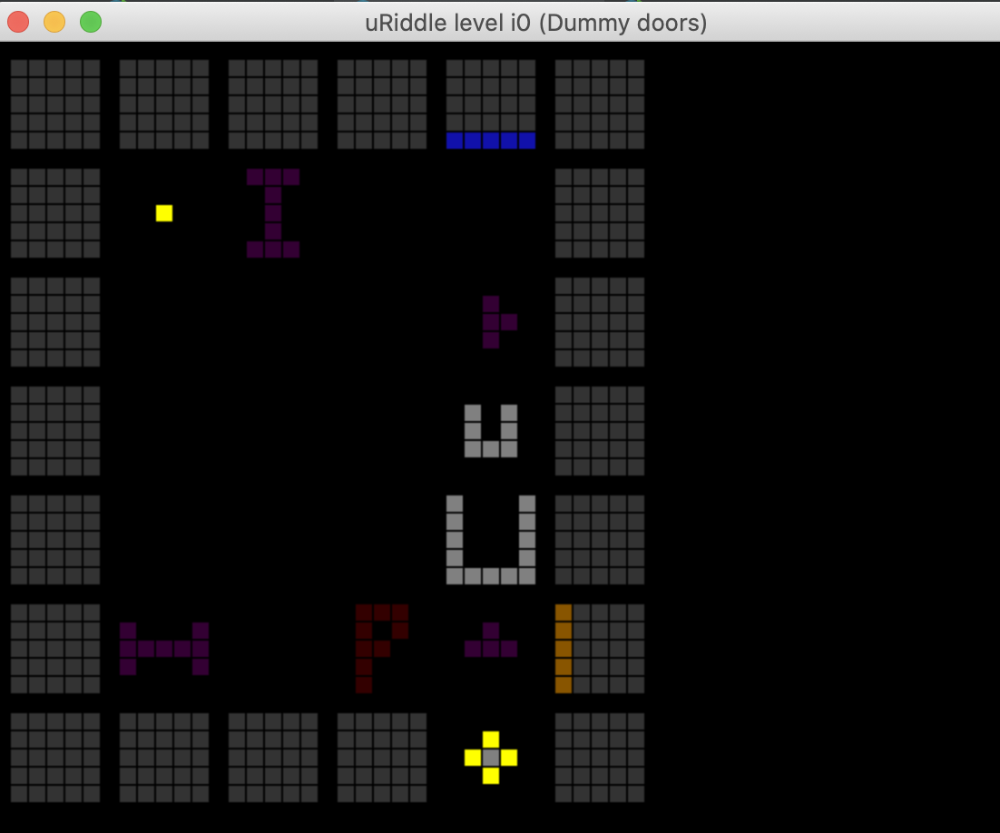

# uRiddleFX

Simple puzzle game, written in Java FX, to test the logic, before deploying it to the play store

Move with W, A, S, D, change levels with N and P (next, prev)

Now with:

- Doors and switches
- Portals
- Pixelate button
- Mirror Player

Download: <a href="https://github.com/karsten314159/uRiddleFX/raw/master/out/artifacts/uRiddleFX/uRiddleFX.jar">Jar file</a>

