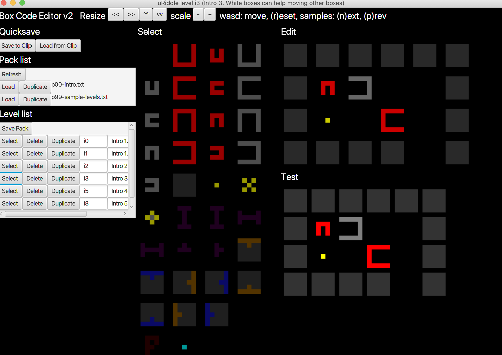

# THE BOX CODE EDITOR

Simple puzzle game, written in Java FX, to test the logic, before deploying it to the play store

Move with W, A, S, D, change levels with N and P (next, prev)

Now with:

- Doors and switches
- Portals
- Pixelate button
- Mirror Player

EDITOR FEATURES:
- Change Scaling
- Level packs
- Auto playtest
- IO in files
- Comes with samples
- Easy file short cut buttons
- Select / Delete / Duplicate Level

1. Download: <a href="https://github.com/karsten314159/uRiddleFX/raw/master/out/artifacts/uRiddleFX/uRiddleFX.jar">Jar file</a>
1. Download: <a href="https://github.com/karsten314159/uRiddleFX/raw/master/out/artifacts/uRiddleFX/p99-sample-levels.txt">sample level txt file</a>
2. Download + Install Java <a href="https://portableapps.com/apps/utilities/java_portable">e.g. here as a portable version</a>
3. Run <tt>java -jar uRiddleFX.jar</tt>

